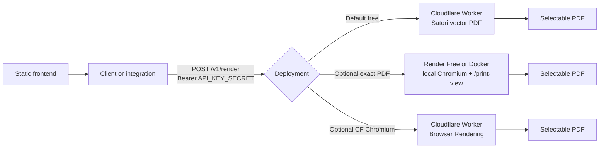

# RenderInvoice

An unopinionated invoice generator. You supply the data. It renders the PDF.

Open [the playground](https://renderinvoice.com/playground), fill the form or paste JSON, download a vector PDF. No account. Nothing is uploaded. Drafts live in IndexedDB on your machine.

Most invoice tools pick your columns, compute your tax, and keep the file on their server. This one does none of that. You name the fields. You type the totals. Your accountant checks the numbers, not the software.

[Playground](https://renderinvoice.com/playground) · [Examples](https://renderinvoice.com/examples) · [API docs](https://renderinvoice.com/developers) · [llms.txt](https://renderinvoice.com/llms.txt)

## What it does

- Form editor and a raw JSON editor, with a live preview
- Any columns, any number of recipients, any summary rows. Drag to reorder all of them.
- Markdown in any field
- Logo and signature, from a URL or an upload
- Classic or bold layout, curated typefaces, any accent color, LTR or RTL
- Vector PDF with selectable text. Auto-fit to one page, or A4.
- Optional footer rule on the PDF that reopens that exact invoice in the editor
- Local drafts, history, and templates. Share as a URL or a QR code.
- Works offline. Installable as a PWA.

Currency, dates, and totals are whatever you type. RenderInvoice never recalculates them.

**Supported typefaces:** Inter, Source Serif 4, IBM Plex Sans, Playfair Display, Space Grotesk, DM Sans, Fraunces, Libre Baskerville, Instrument Sans, Newsreader. Unknown `font` values fall back to Inter.

## For scripts and agents

The invoice is JSON. Put it in the URL hash and the page hydrates itself. There is no hosted render API on renderinvoice.com.

```
https://renderinvoice.com/playground#j=<encodeURIComponent(JSON.stringify(invoice))>
https://renderinvoice.com/print-view#j=<same>
```

`#j=` is plain JSON. `#i=` is the same payload compressed with lz-string.

Agents can read [`/llms.txt`](https://renderinvoice.com/llms.txt) for the live schema. For PDF **bytes**, self-host one of the options below and `POST /v1/render`.

## Shared API contract

Both Cloudflare and Render/Docker use the same route and auth:

```http
POST /v1/render
Authorization: Bearer <API_KEY_SECRET>
Content-Type: application/json
```

```json
{ "invoice": { "...": "..." } }
```

Bare invoice objects are also accepted. Responses: PDF bytes (Cloudflare also supports `?format=png`). Missing or wrong key → `401`. IP not on allowlist → `403`. Bad body → `400`.

`API_KEY_SECRET` is **required**. Optional `ALLOWED_IPS` is a comma-separated list of caller IPs.

## Deployment architecture



### 1. Free: Cloudflare Satori (default)

[](https://deploy.workers.cloudflare.com/?url=https://github.com/hithismani/render-invoice/tree/main)

```bash
npx wrangler secret put API_KEY_SECRET
npx wrangler deploy
```

Vector PDF with selectable text, path geometry, and edit links. Same invoice template as the playground. Repo must stay **public** for the one-click button.

### 2. Optional: Render Free or Docker (Chromium)

Exact PDF from local `/print-view` inside the container. No dependency on renderinvoice.com at runtime.

**Blueprint (recommended):**  
[Deploy on Render](https://dashboard.render.com/blueprint/new?repo=https://github.com/hithismani/render-invoice)

```bash
docker build -f render-service/Dockerfile -t renderinvoice-browser .
docker run --rm -p 10000:10000 \
  -e API_KEY_SECRET=replace-me \
  -e ALLOWED_IPS=203.0.113.10 \
  renderinvoice-browser
```

Docs: [`render-service/README.md`](render-service/README.md)

### 3. Optional: Cloudflare Browser Rendering

[](https://deploy.workers.cloudflare.com/?url=https://github.com/hithismani/render-invoice/tree/main/cf-worker)

```bash
cd cf-worker && pnpm install
npx wrangler secret put API_KEY_SECRET
npx wrangler deploy
```

Needs Browser Rendering on your Cloudflare account. Free Satori path already returns a vector PDF for most cases.

### Call either host the same way

```bash
curl -X POST https://your-host/v1/render \
  -H "Authorization: Bearer $API_KEY_SECRET" \
  -H 'Content-Type: application/json' \
  --data-binary @invoice.json \
  --output invoice.pdf
```

## Estimated costs

Planning estimates only, not provider quotes:

| Deployment | Estimate | Notes |
| --- | ---: | --- |
| Cloudflare Satori Worker | $0 free plan | Subject to Cloudflare free limits |
| Render Free Chromium service | $0 | Sleeps when idle; cold starts; limited concurrency |
| Self-hosted Docker | $0 on your machine | You own uptime and bandwidth |
| Small Docker VM | Roughly $5–10/month | Provider and traffic dependent |
| Cloudflare Browser Rendering | Provider pricing | Check current Cloudflare pricing |

## Repo layout

- [`web/`](web/) — Next.js static site (playground, examples, print-view)
- [`cf-worker/`](cf-worker/) — Cloudflare Worker (free Satori PDF; optional Browser Rendering)
- [`render-service/`](render-service/) — Docker/Render Chromium PDF service
- [`render.yaml`](render.yaml) — Render Blueprint

More: [web/README.md](web/README.md) · [cf-worker/README.md](cf-worker/README.md) · [render-service/README.md](render-service/README.md) · [renderinvoice.com/developers](https://renderinvoice.com/developers)

## Disclaimer

Provided **as-is, without warranties or guarantees** of any kind, including merchantability, fitness for a particular purpose, accuracy of rendered invoices, uptime, or continued free-tier availability.

You must verify totals, tax, and legal requirements before sending invoices. Free hosting tiers may sleep, throttle, change, or end without notice. Self-hosted deployments are your responsibility for secrets, IP allowlists, security, and scaling.

See [Terms of service](https://businessaddons.com/disclaimers/terms-of-service) and [Privacy policy](https://businessaddons.com/disclaimers/privacy-policy). A [BusinessAddons](https://businessaddons.com) product.
